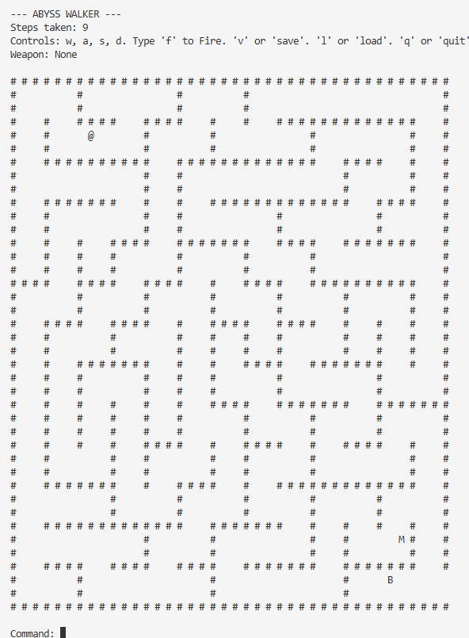
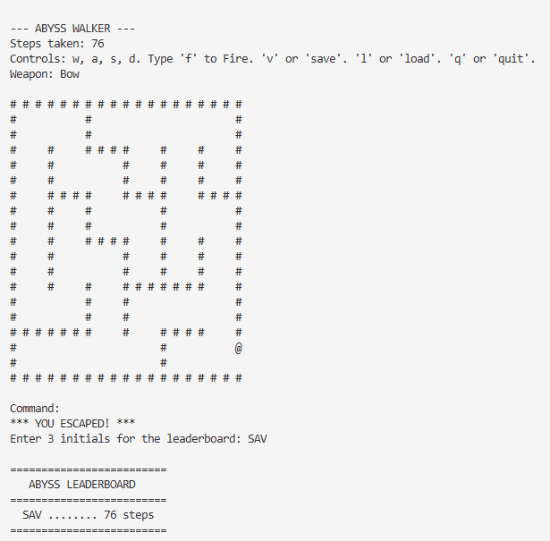

# Abyss Walker

**Abyss Walker** is a terminal maze game written in strict C90.

You wake up inside a dark generated maze. Somewhere in the maze is a bow, somewhere else is a monster and the only way out is to explore carefully, survive, and escape in as few steps as possible.

This project was originally built for SUTD Term 6 50.051 Programming Language Concepts (PLC) 2026. For the full technical write-up, see [docs/PLC_Report.pdf](docs/PLC_Report.pdf).

## Demo

### Maze Gameplay

The game runs directly in the terminal. The player is shown as `@`, the monster is `M`, and the bow is `B`.



### Successful Clear

When the player escapes, the run is recorded on the leaderboard using the number of steps taken.



## Quick Start

### Windows: Run the Included Executable

If you are on Windows and just want to try the game, run:

```powershell
.\abyss_walker.exe
```

Keep `config.txt` in the same folder as the executable. The game reads that file to decide what maze to generate when it starts.

### Build From Source

If you want to compile the project yourself, you need:

- `gcc`
- GNU `make`

On Linux or MSYS2 Windows:

```bash
make
```

On standalone MinGW-w64 Windows:

```powershell
mingw32-make
```

The Makefile auto-detects the platform and creates:

- `abyss_walker` on Linux
- `abyss_walker.exe` on Windows

### Manual Build

Linux:

```bash
gcc -Wall -Werror -ansi -pedantic -Iinclude src/main.c src/map.c src/enemy.c src/config.c src/save.c -o abyss_walker
```

Windows:

```powershell
gcc -Wall -Werror -ansi -pedantic -Iinclude src/main.c src/map.c src/enemy.c src/config.c src/save.c -o abyss_walker.exe
```

## Run

Linux:

```bash
./abyss_walker
```

Windows:

```powershell
.\abyss_walker.exe
```

## How To Play

Your goal is to escape the maze while avoiding the monster.

- `@` is you.
- `M` is the monster.
- `B` is the bow.
- Move around the maze to find the bow and the exit.
- Once you pick up the bow, you can fire at the monster if there is a clear line of sight.
- If the monster catches you, the game ends.
- If you escape, your score is saved to the leaderboard.

## Controls

| Command | Action |
| --- | --- |
| `w` | Move up |
| `a` | Move left |
| `s` | Move down |
| `d` | Move right |
| `f` | Fire the bow, if you have picked it up |
| `v` or `save` | Save the current game to `maze.sav` |
| `l` or `load` | Load from `maze.sav` |
| `q` or `quit` | Quit the game |

## Configuration

The game can be adjusted through `config.txt`.

```text
width=6
height=6
seed=0
density=100
```

The available settings are:

- `width`: maze width in cells, from `3` to `30`
- `height`: maze height in cells, from `3` to `20`
- `seed`: `0` for a random maze each run, or any other non-negative number for a repeatable maze
- `density`: `100` for a perfect maze with no extra openings, lower values for a more open maze

This means you can make the maze larger, smaller, more predictable, or more chaotic without changing the source code.

## Docker

You can also run the game through Docker.

Quick start:

```bash
docker/run.sh
```

Force a fresh rebuild:

```bash
docker/run.sh --rebuild
```

Reset the save and leaderboard volume:

```bash
docker/run.sh --reset
```

Or run Docker Compose directly:

```bash
docker compose -f docker/docker-compose.yml run --rm --build abyss-walker
```

Stop and remove containers/networks after exiting:

```bash
docker compose -f docker/docker-compose.yml down
```

## Project Layout

```text
PLC/
|-- src/          C source files
|-- include/      Header files
|-- docs/         Report, diagrams, screenshots, and presentation
|-- docker/       Dockerfile and Docker Compose setup
|-- config.txt    Runtime configuration
|-- Makefile
|-- README.md
|-- README2.md
```

## Technical Overview

Abyss Walker is intentionally built with a small, portable C codebase. The source follows strict C90 rules and avoids platform-specific APIs so that the same game logic can be compiled on both Linux and Windows.

The main technical parts are:

- **Procedural maze generation:** the maze is created when the game starts, using the configured size, seed, and density.
- **Game state management:** the program moves through clear phases such as maze generation, active play, game over, and leaderboard display.
- **Enemy movement:** the monster moves through the maze and pressures the player while they search for a path out.
- **Config parsing:** `config.txt` is parsed at startup so the game can be tuned without recompiling.
- **Save/load support:** saved games use explicit little-endian binary serialization, which keeps the save format more predictable across platforms.
- **Leaderboard recording:** successful clears are stored and displayed so players can compare step counts.

For the full implementation explanation, see [docs/PLC_Report.pdf](docs/PLC_Report.pdf).

### Game State Flow


### Maze Generation


### Enemy AI


### Config Parser


## Clean Build Files

```bash
make clean
```

On standalone MinGW-w64 Windows:

```powershell
mingw32-make clean
```
